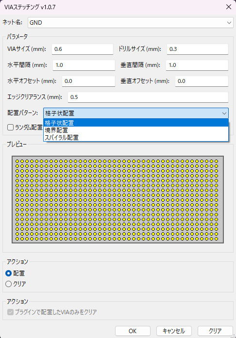

# KiCad VIAステッチングプラグイン V2.0.7

KiCadのPCBエディタ（Pcbnew）で選択された銅エリアにVIAを自動配置するプラグインです。熱伝導や電流伝導を改善するためのVIAステッチングを効率的に行うことができます。

## 📋 機能

- **自動VIA配置**: 選択されたゾーン（銅エリア）内にVIAを自動配置
- **複数の配置パターン**: 格子状、境界配置、スパイラル配置に対応
- **高速処理**: 空間インデックス化により大量のVIA配置を高速化
- **プログレスバー**: 長時間の処理にもプログレス表示でユーザビリティ向上
- **ランダム配置**: 規則的でない配置も可能
- **VIAクリア機能**: プラグインで配置したVIAのみの削除も可能
- **設定保存**: パラメータ設定を保存・復元
- **リアルタイムプレビュー**: 配置パターンをダイアログ内でプレビュー表示

## 🎯 対応環境

- **KiCad**: 9.0.2 で動作確認済み（他のバージョンでも動作する可能性があります）
- **OS**: Windows, Linux, macOS
- **Python**: KiCad付属のPythonランタイム

## ⚡ インストール方法

1. `via_stitcher_v2.py` をダウンロード
2. KiCadのプラグインフォルダに配置：
   - **Windows**: `%APPDATA%\kicad\<version>\scripting\plugins\`
   - **Linux**: `~/.local/share/kicad/<version>/scripting/plugins/`
   - **macOS**: `~/Library/Application Support/kicad/<version>/scripting/plugins/`
3. KiCadを再起動
4. Pcbnewのツールメニューから「External Plugins」→「VIAステッチングV2」を選択

## 🚀 使用方法

1. Pcbnewでプロジェクトを開く
2. VIAを配置したいゾーン（銅エリア）を選択
3. プラグインメニューから「VIAステッチングV2」を実行
4. ダイアログでパラメータを設定：
   - VIAサイズ・ドリルサイズ
   - 配置間隔・オフセット
   - エッジクリアランス
   - 配置パターン選択
   - ネット選択
5. 「OK」ボタンでVIA配置実行

### 配置パターン

- **格子状配置**: 規則的な格子パターンでVIAを配置
- **境界配置**: ゾーンの境界線に沿ってVIAを配置(一部配置が乱れます)
- **スパイラル配置**: 中心から外側に向けてスパイラル状に配置

## ⚠️ 制約事項・注意点

- **CC0ライセンス**: パブリックドメインで提供されています
- **個人開発**: サポートは期待できません
- **四角形以外の領域**: 複雑な形状のゾーンでは、はみ出して描画される場合があります
- **衝突判定**: 衝突判定はありません、指定ゾーンに強制的に描画されます
- **バックアップ推奨**: 使用前に必ずプロジェクトのバックアップを取ってください
- **大量VIA**: 大量のVIA配置時はKiCadが重くなる場合があります
- **DRCチェック**: 配置後は必ずDRCチェックを実行してください

## 🔧 既知の問題

- 複雑な形状のゾーンでの配置精度
- 非常に密な配置でのメモリ使用量増加
- 一部のKiCadバージョンでのAPI互換性問題

## 💡 トラブルシューティング

### プラグインが表示されない
- KiCadを再起動してください
- プラグインファイルの配置場所を確認してください

### VIAが配置されない
- ゾーンが正しく選択されているか確認してください
- 配置パラメータ（間隔・クリアランス）を調整してください
- ネットが正しく選択されているか確認してください

### 動作が重い
- VIA配置数を減らしてください（間隔を広くする）
- プログレスダイアログでキャンセルできます

## 🔄 更新履歴

### V2.0.7 (2025年版)
- 初版

## 📄 ライセンス

CC0 1.0 Universal (CC0 1.0) Public Domain Dedication

このプラグインは無料で提供されており、**寄付は一切不要**です。
自由にご利用、改変、再配布してください。

## ⚖️ 免責事項

このプラグインの使用により発生したいかなる損害についても、開発者は責任を負いません。
使用は自己責任でお願いします。必ず使用前にプロジェクトのバックアップを取ってください。

---

*KiCad VIAステッチングプラグイン - より効率的なPCB設計のために*